# <u>**32 x 32 Pixel-Tint GUI**</u>

The 32x32 Pixel-Tint system GUI explores the phenomena of light leveraging on electromechanical systems that manipulate polarization to synergize pixelized art forms. 

We chose to do a 32x32 pixelated image because we want to make the picture more detailed and sharper so that we can distinguish the elements from one another as compared to the picture below.
<br>


<br>

*16X16 Pixelized Images*

<br>
The 32x32 Pixel-Tint GUI allows the user to choose from an array of 8 different shades of grey and the preset patterns to the squares within the 32x32 grid. The "Send Image!" button outputs a total of 1024 buttons of the colour value according to the preset patterns that are chosen. 

<br>

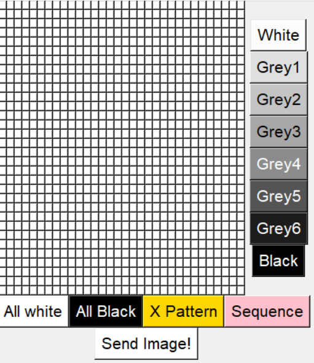
<br>

*32X32 Pixel-Tint GUI*

<br>

## **Hardware** 
1. Single Board Computer: Raspberry Pi 4 Model B
2. Operating System: Raspbian Buster Full

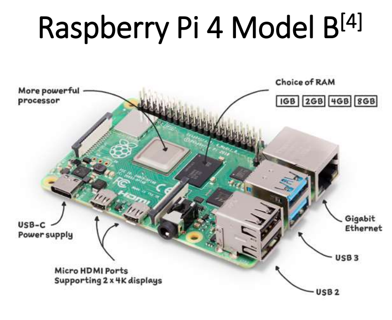
<br>

*Fu YongWei, EGL314, Lecture notes 1*

## **Software** 
1. PuTTY 
2. VNC Viewer
3. Python

<br>

## **Installation** 

<font size = "4">1. Secure Shell (SSH) into Raspberry Pi using PuTTY.</font>
 
 ```
 Hostname: pi@ip_address
 Port: 22
 Password: (user_defined)
 ```
<br>

Take Note: Only to update Raspberry Pi on the first intial boot

<font size = "4">2. Update the Raspberry Pi</font> 

```
sudo apt update
sudo apt upgrade
```
<font size = "4">3. Configure Raspberry Pi</font> 

<font size = "3"> **Enable SSH** </font>

SSH is a network protocol that gives users, particularly system administrators, a secure way to access a computer over an unsecured network. To enable SSH type the following:

```
sudo raspi-config
```
Select `3 Interface Options` <br>
Select `P2 SSH` <br>
Select ***Enable SSH***

<br>

<font size = "3"> **Enable Virtual Network Computing (VNC)** </font>
<br>
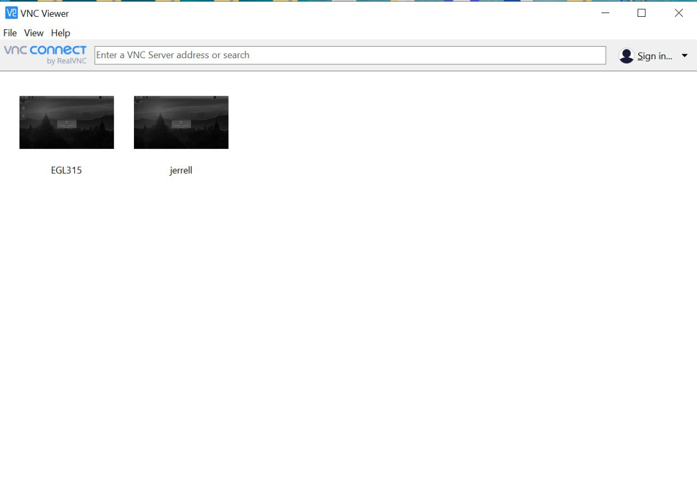
*Connect the account to VNC viewer*


*Inside VNC Viewer*


VNC is a cross-platform screen sharing system that was created to remotely control another computer. To enable VNC type the following:
```
sudo raspi-config
```
Select `3 Interface Options` <br>
Select `P3 VNC` <br>
Select ***Enable VNC***

<br>

<font size = "4">Enable HDMI Hotplug</font> 

By default, VNC Viewer will not work on a Raspberry Pi without any active HDMI connection onto a monitor. We can enable **hdmi_force_hotplug** to force a HDMI signal even without any active HDMI connection.

To enable **hdmi_force_hotplug**, type the following:

```
sudo nano /boot/config.txt
```

Scroll to the bottom of the file and paste:

```
hdmi_force_hotplug=1
```

Save and exit the nano file editor:

`ctrl + o` to write (save) the file

`ctrl + x` to exit the editor

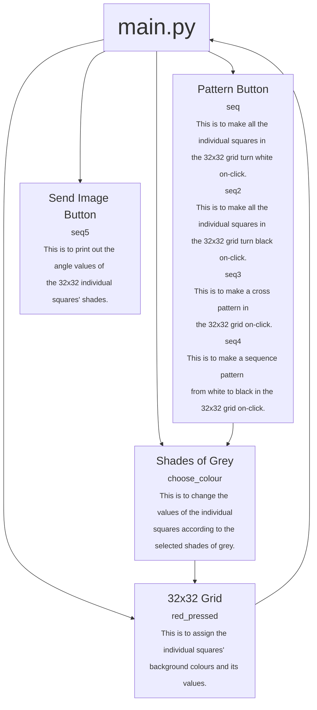

## **GUI Setup**

Firstly, we will need to import the tkinter library.

```
from tkinter import *
```

Next, we will need to create a main GUI window. Here, we changed the title to '32X32 Polarization Grid'. You can change the title to your preference.
```
main = Tk()
main.title("32X32 Polarization Grid")
```

For the window to stay, we will need to loop it.
```
main.mainloop()
```

<font size = "4">Output</font>


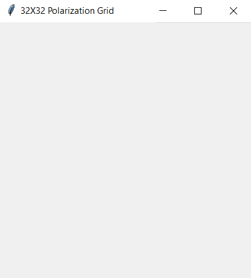
<br>

*Main GUI Window*

<br>

## Creating the Frames

Creating the frames is important as it does not allow the grid or buttons to overscale, or mess up the arrangement of the buttons.

The first frame created will be for the 32x32 grid.

```
frame1 = Frame(main)
frame1.grid(row=0, column=0)
```

The second frame created will be for the selection of the 8 shades of grey.

```
frame2 = Frame(main) 
frame2.grid(row=0, column=1)
```

The last frame created will be for the preset pattern buttons. (etc. All White, All Black, X Pattern, Sequence, Send Image)

```
frame3 = Frame(main)
frame3.grid(row=1 , column=0, columnspan=2)
```
<font size = "4">Output</font>

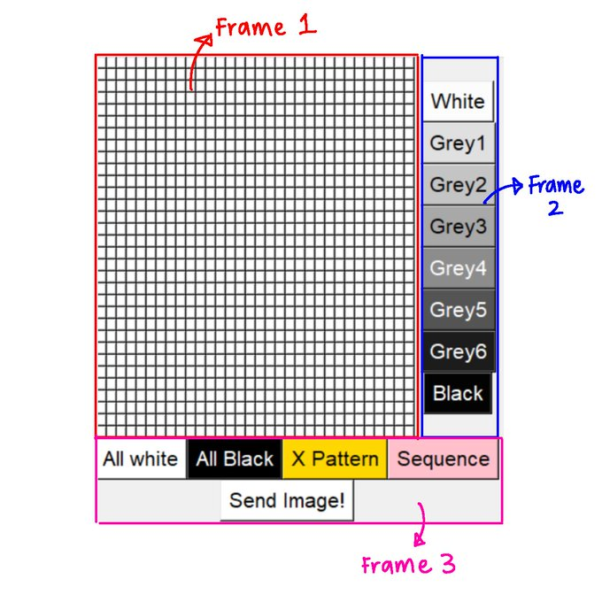
<br>

*Frames*

## Creating the 32x32 Grid

Here, we will be creating the 32x32 grid.

```
colour = 0
o = 32
```
>The default colour of the 32x32 grid is white, and the value of white is 0.<br>
The variable `o` represents the number of rows and columns. In this case, we assigned 32 to the variable `o`.

<br>

This is to assign the individual squares' background colours and its values.
```
def red_pressed(r, c): 
    global colour
    if colour == 0:
        button[r][c].config(bg='grey99')
        value[r][c] = colour 
    elif colour == 20:
        button[r][c].config(bg='grey88')
        value[r][c] = colour
    elif colour == 30:
        button[r][c].config(bg='grey77')
        value[r][c] = colour
    elif colour == 40:
        button[r][c].config(bg='grey66')
        value[r][c] = colour
    elif colour == 50:
        button[r][c].config(bg='grey44')
        value[r][c] = colour
    elif colour == 60:
        button[r][c].config(bg='grey33')
        value[r][c] = colour
    elif colour == 70:
        button[r][c].config(bg='grey11')
        value[r][c] = colour
    else:
        button[r][c].config(bg='grey1') 
        value[r][c] = colour
```
<br>

We used a List of List and a nested for loop to create the 32x32 grid and its values.


```
button = [[r for r in range(o)] for c in range(o)] 
value = [[colour for r in range(o)] for c in range(o)]

for r in range(o):
    for c in range(o):
        button[r][c] = Button(frame1, bg="white", text="  ", font=('Arial',5), command=lambda e=r, l=c:red_pressed(e, l))
        button[r][c].grid(row=r, column=c) 
        value[r][c] = colour
```

<font size = "4">Output</font>

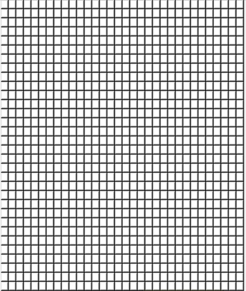
<br>

*32x32 Grid*

## Creating 8 Shades of Grey

We used the Button widget to create 8 different buttons of shades of grey. Changing the individual squares' shades will also change their angle values.

<br>

This is to change the values of the individual squares according to the selected shades of grey.

```
def choose_colour(button_pressed):
    global colour 
    colour = button_pressed
```

This is to create the buttons of the 8 different shades of grey.

```
colourgrey = Button(frame2, text="White", bg=('grey99'), height=1 , width=4 , font=(200), command=lambda m=0:choose_colour(m))
colourgrey.grid(row=0, column=1)

colourgrey1 = Button(frame2, text="Grey1", bg=('grey88'), height=1 , width=4 , font=(200), command=lambda m=20:choose_colour(m))
colourgrey1.grid(row=1, column=1)

colourgrey2 = Button(frame2, text="Grey2", bg=('grey77'), height=1 , width=4 , font=(200), command=lambda m=30:choose_colour(m))
colourgrey2.grid(row=2, column=1)


colourgrey3 = Button(frame2, text="Grey3", bg=('grey66'), height=1 , width=4 , font=(200), command=lambda m=40:choose_colour(m))
colourgrey3.grid(row=3, column=1)


colourgrey4 = Button(frame2, text="Grey4", fg=('white'), bg=('grey55'), height=1 , width=4 , font=(200), command=lambda m=50:choose_colour(m))
colourgrey4.grid(row=4, column=1)


colourgrey5 = Button(frame2, text="Grey5", fg=('white'), bg=('grey33'), height=1 , width=4 , font=(200), command=lambda m=60:choose_colour(m))
colourgrey5.grid(row=5, column=1)


colourgrey6 = Button(frame2, text="Grey6", fg=('white'), bg=('grey11'), height=1 , width=4 , font=(200), command=lambda m=70:choose_colour(m))
colourgrey6.grid(row=6, column=1)


colourblack = Button(frame2, text="Black", fg=('white'), bg=('grey1'), height=1 , width=4 , font=(200), command=lambda m=90:choose_colour(m))
colourblack.grid(row=7, column=1)
```
<font size = "4">Output</font>

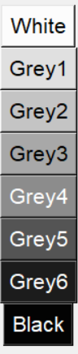
<br>

*8 Shades of Grey*

## Creating the Preset Pattern Buttons

Here, we created 4 Preset Pattern Buttons in which each button will have their own specific outputs. Changing the individual squares' shades will also change their angle values.

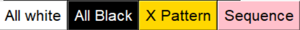
<br>

*Preset Pattern Buttons*

<br>

This is to create the All White preset button.
```
colourRed = Button(frame3, text="All white", bg=('white'), font=(200), command=seq)
colourRed.grid(row=0, column=0)
```

<font size = "4">Output</font>

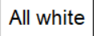
<br>

*All White Button*

<br>

This is to make all the individual squares in the 32x32 grid turn white on-click. At the same time, the values of the individual squares will all change to 0.
```
def seq():
    global values
    for r in range(o):
        for c in range(o):
            button[r][c].config(bg='grey99')
            value[r][c] = values[0]
```

<font size = "4">Output</font>

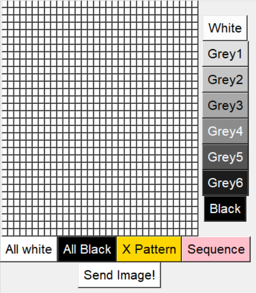
<br>

*All White Outcome*

<br>

This is to create the All Black preset button.

```
colourGreen = Button(frame3, text="All Black", fg=('white'), bg=('black'), font=(200), command=seq2)
colourGreen.grid(row=0, column=1)
```


<font size = "4">Output</font>

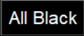
<br>

*All Black Button*

<br>

This is to make all the individual squares in the 32x32 grid turn black on-click.

```
def seq2():
    global values
    for r in range(o):
        for c in range(o):
            button[r][c].config(bg='grey1')
            value[r][c] = values[7]
```

<font size = "4">Output</font>

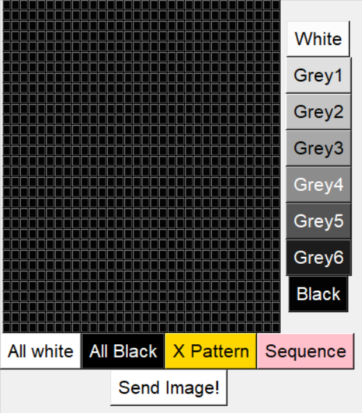
<br>

*All Black Outcome*

<br>

This is to create the X Pattern preset button.

```
colourBlue = Button(frame3, text="X Pattern", bg=('gold'), font=(200), command=seq3)
colourBlue.grid(row=0, column=2)
```


<font size = "4">Output</font>

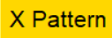
<br>

*X Pattern Button*

<br>

This is to make a cross pattern in the 32x32 grid on-click.


```
def seq3():
    global values
    for r in range(o):
        for c in range(o):
            if r == c or r+c == o-1:
                button[r][c].config(bg='grey1')
                value[r][c] = values[7]
            else: 
                button[r][c].config(bg='grey99')
                value[r][c] = values[0]
```

>`r == c` is for the diagonal line from top left to bottom right of the 32x32 grid.<br>
`r+c == o-1` is for the diagonal line from top right to bottom left of the 32x32 grid.<br>
If either one of the arguments are true, `button[r][c].config(bg='grey1')` will change the colour of the individual squares to black.<br>
`value[r][c] = values[7]` changes the value of the individual squares' (that fulfill either of the two arguments') angles to 90.<br>
If neither are true, `button[r][c].config(bg='grey99')` will change the colour of the individual squares to white. <br>
`value[r][c] = values[0]` changes the value of the individual squares' (that fulfill neither of the two arguments') angles to 0.

<font size = "4">Output</font>

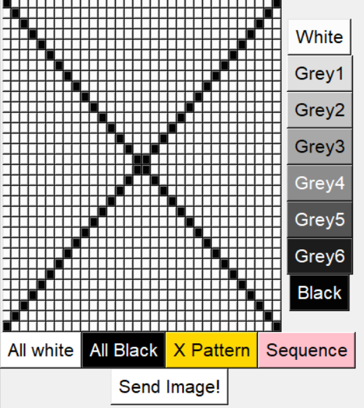
<br>

*X Pattern Outcome*

<br>

This is to create the Sequence preset button.

```
colourGold = Button(frame3, text="Sequence", bg=('pink'), font=(200), command=seq4)
colourGold.grid(row=0, column=3)
```


<font size = "4">Output</font>


<br>

*Sequence Button*

This array is to store the values of the 8 different shades of grey.

```
values = [0,20,30,40,50,60,70,90]
```

<br>

This is to make a sequence pattern from white to black in the 32x32 grid on-click.

```
def seq4():
    global colours, colour, values
    colours = ['grey99','grey88','grey77','grey66','grey44','grey33','grey11','grey1']
    p = -1
    for r in range(o):
        for c in range(o):
            p = p+1
            if p > len(colours)-1:
                p = 0
            button[r][c].config(bg=colours[p])
            value[r][c] = values[p]
```

>`colours = ['grey99','grey88','grey77','grey66','grey44','grey33','grey11','grey1']` defines the array of colors that will be displayed in this sequence pattern.<br>
By making `p = -1` , we make it so that the very first square of the grid will start as white, the first color (`grey99`) in the array. <br>
`p = p+1` will continue the pattern within the grid by increasing the values within the array by an increment of 1, until it reaches the end of the colour array.<br>
Once the first sequence within the grid reaches the end of the array (`grey1`), the line `p = 0` will ensure that the array will be reset to 0 (`grey99` or white). This is achieved by the if statement `if p > len(colours)-1`, where `len(colours)-1` will give the array value of 7 (8-1 = 7), and that the array value should not go beyond 7.<br>
Afterwards, since we are only contiuing the sequence, there is no need to use `p = -1` as the next square after the first sequence will be white, thus `p = 0` is used after the if statement.


<font size = "4">Output</font>

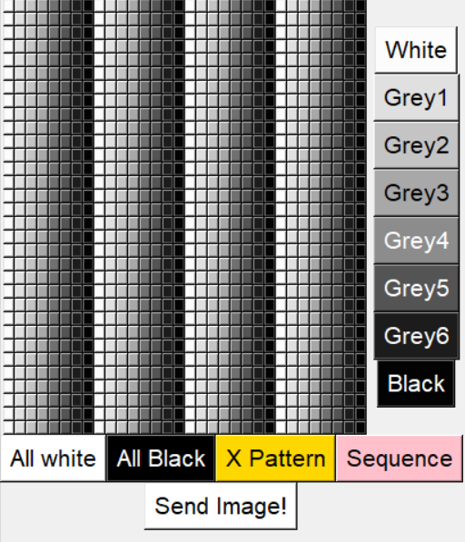
<br>

*Sequence Outcome*

## Creating the Send Image Button

Here, we created a button labelled 'Send Image!' to generate a List of List in which the output consists of 32 rows and 32 columns of values.

This is to create the Send Image button.

```
colourOrange = Button(frame3, text="Send Image!", bg=('white'), font=(200), command=seq5) 
colourOrange.grid(row=1, columnspan=2, column=1)
```

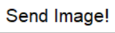
<br>


*Send Image Button*

<br>

This is to print out the angle values of the 32x32 individual squares' shades. 

```
def seq5():
    global colour, colours, values
    print(value)
```
In order to view the values from the terminal, you will need to change the directory to the folder of the file. After changing the directory, you will need to enter `python3 filename.py` to print the output.


1. Open the terminal on Raspberry Pi.
2. In the terminal, type the following commands under this format: 
```
cd /Directory
```

Example:

```
cd /home/pi/Documents/EGL314/
```
3. Once inside the directory folder of your file, type in the following:

```
python3 main.py
```

<font size = "4">Output</font>

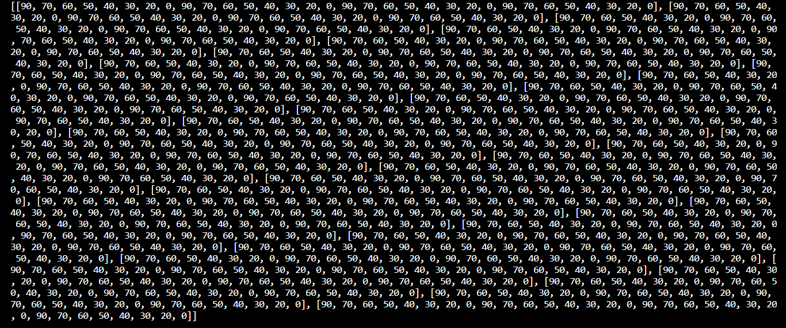
<br>


*The values printed are based on the sequence pattern.*


