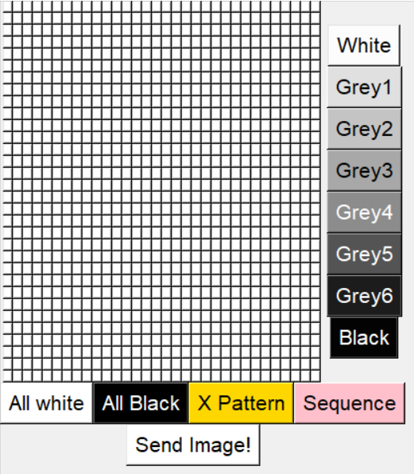
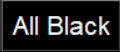
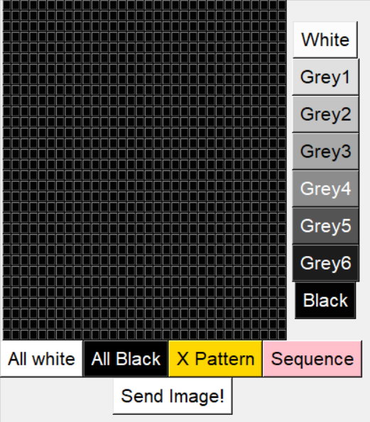
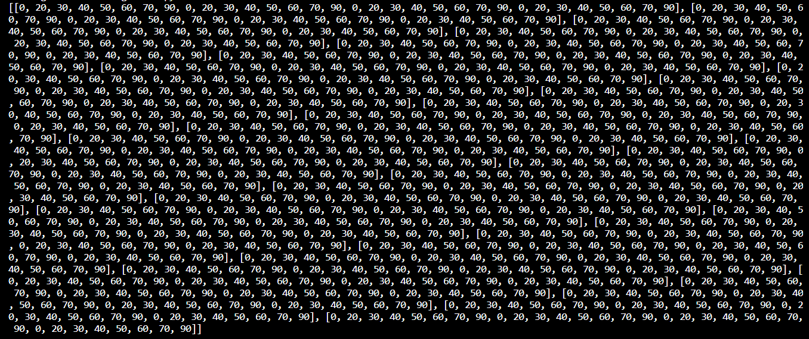

# <u>**32 x 32 Polarization Grid**</u>


Raspberry Pi Project on coding for a 32x32 grid that allows the user to change any square within the grid to 8 different shades of grey.

# <u>Features</u>

## **Grid:** 


A 32x32 grid that allows the user to interact with by clicking on them and changing the shade of grey to individual squares however they may like.

<br>

## **Shade Selections:** 


8 buttons for 8 different shades of grey for the user to pick any colour they prefer.

<br>

## Sample Outcome:


<br>

## **All White Button:** 


All White button changes the shade of the whole grid to white.

<br>

## Sample Outcome:


<br>

## **All Black Button:** 



All Black button changes the shade of the whole grid to black.

<br>

## Sample Outcome:



<br>

## **X Pattern Button:** 


X Pattern button changes the whole grid into a cross pattern.

<br>

## Sample Outcome:


<br>

## **Sequence Button:** 


Sequence button changes the whole grid into a specific sequence of shades. Our sequence of colour goes from white to black.

<br>

## Sample Outcome:


<br>

## **Send Image Button:** 


To generate a List of List in which the output consists of 32 rows and 32 columns of values.

<br>

## Sample Outcome:



<br>

# <u>How The Code Works</u>

## **Grid:** 

> A 32x32 grid that allows the user to interact with by clicking on the buttons and changing the shade of grey on individual buttons however they may like.

<br>

>We have assigned the default value of the colour to 0.
This colour variable is to assign the button's background colour and its angle to 0, and also to make the individual squares in the grid white by default.

```
colour = 0
```

<br>

>what to write

```
def red_pressed(r, c): 
    global colour
    if colour == 0:
        button[r][c].config(bg='grey99') #to configure the background colour of the grid selected with the selected colour
        value[r][c] = values[0] #assign the grid's angle value based on the colour selected
    elif colour == 20:
        button[r][c].config(bg='grey88')
        value[r][c] = values[1]
    elif colour == 30:
        button[r][c].config(bg='grey77')
        value[r][c] = values[2]
    elif colour == 40:
        button[r][c].config(bg='grey66')
        value[r][c] = values[3]
    elif colour == 50:
        button[r][c].config(bg='grey44')
        value[r][c] = values[4]
    elif colour == 60:
        button[r][c].config(bg='grey33')
        value[r][c] = values[5]
    elif colour == 70:
        button[r][c].config(bg='grey11')
        value[r][c] = values[6]
    else:
        button[r][c].config(bg='grey1') 
        value[r][c] = values[7]
```

<br>

>"o" represents the number of rows and columns we would want in our grid. In this case, we want 32 rows and 32 columns in our grid.


```
o = 32
```
>Afterwards, we created a `for loop` in which both rows and columns will be generated.<br> 
The "button" variable is for us to be able to interact with the individual squares as buttons within the 32x32 grid.<br> 
The "value" variable is to store the angle value of the corresponding grid according to the colour selected<br>r = rows<br>c = columns
```
button = [[r for r in range(o)] for c in range(o)]
value = [[colour for r in range(o)] for c in range(o)]

for r in range(o):
    for c in range(o):
        button[r][c] = Button(frame1, bg="white", text="  ", font=('Arial',5), command=lambda m=r, l=c:red_pressed(m, l))
        button[r][c].grid(row=r, column=c) 
        value[r][c] = colour

```


## **Shade Selections:** 

> 8 buttons for 8 different shades of grey for the user to pick whichever shade they prefer.It's for us to be able to select the different shades of grey of the individual squares within the 32x32 grid.

```
colourblack = Button(frame2, text="Black", fg=('white'), bg=('grey1'), font=(200), command=lambda m=90:choose_colour(m))
colourblack.grid(row=0, column=1)
```

## **All White Button:** 

> Changes the shade of the whole grid to white.
```
colourRed = Button(frame3, text="All white", bg=('white'), font=(200), command=seq)
colourRed.grid(row=0, column=0)

def seq():
    global values
    for r in range(o):
        for c in range(o):
            button[r][c].config(bg='grey99')
            value[r][c] = values[0]
```

## **All Black Button:** 

> Changes the shade of the whole grid to black.
```
colourGreen = Button(frame3, text="All Black", fg=('white'), bg=('black'), font=(200), command=seq2)
colourGreen.grid(row=0, column=1)

def seq2():
    global values
    for r in range(o):
        for c in range(o):
            button[r][c].config(bg='grey1')
            value[r][c] = values[7]
```

## **X Pattern Button:** 

> Displays a cross pattern on the grid.
```
colourBlue = Button(frame3, text="X Pattern", bg=('gold'), font=(200), command=seq3)
colourBlue.grid(row=0, column=2)

def seq3():
    global values
    for r in range(o):
        for c in range(o):
            if r == c or r+c == o-1: #black x pattern 
                button[r][c].config(bg='grey1')
                value[r][c] = values[7]
            else: 
                button[r][c].config(bg='grey99') #white background
                value[r][c] = values[0]
```

## **Sequence Button:** 

> Changes the whole grid into a specific sequence of shades.
```
colourGold = Button(frame3, text="Sequence", bg=('pink'), font=(200), command=seq4)
colourGold.grid(row=0, column=3)

def seq4():
    global w, colours, colour, values
    colours = ['grey99','grey88','grey77','grey66','grey44','grey33','grey11','grey1']
    p = -1 #variable for colour list 
    for r in range(o):
        for c in range(o):
            p = p+1
            if p > len(colours)-1:
                p = 0
            button[r][c].config(bg=colours[p])
            value[r][c] = values[p]
```

## **Send Image Button:** 

> To generate a List of List in which the output consists of 32 rows and 32 columns of values.
```
colourOrange = Button(frame3, text="Send Image!", bg=('white'), font=(200), command=seq5)
colourOrange.grid(row=1, columnspan=2, column=1)

def seq5():
    global w, colour, colours, values
    print(value)
```
